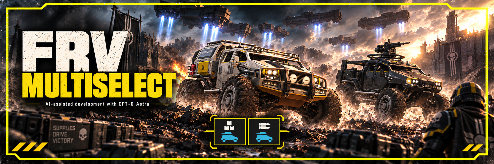

# FRV MultiSelect

By [Toritte](https://github.com/Toritte). Select different Fast Recon Vehicle (FRV) variants together in your stratagem loadout.

## Features
- Bring different available FRV variants on the same mission.

This mod changes FRV selection only. It does not unlock equipment, duplicate the same stratagem, or change cooldowns and call-in limits.

## Requirements and installation
Requires **Bingus Shared Loader v15 / API 1**, downloaded separately from [CowboyBingus on AyakaMods](https://ayakamods.com/mods/bingus-shared-loader.3861/).
The loader is not included in this download. [Official loader instructions](https://github.com/CowboyBingus/BingusSharedLoader).

1. Close the game. Download the mod ZIP from [Releases](https://github.com/Toritte/FRVMultiSelect/releases).
2. Import the loader ZIP and `FRV-MultiSelect-v0.1.zip` into Arsenal or HD2MM.
3. Follow the loader's priority instructions. In Arsenal's default priority, put the loader last; with reversed priority put it first.
4. Deploy then start the game, select your FRVs.

## Uninstallation
Fully close the game, disable FRV MultiSelect, then purge and redeploy your remaining mods before restarting. Keep the loader enabled while other installed mods require it.

## Using it with Exosuit MultiSelect
(https://github.com/Toritte/ExosuitMultiSelect)
You have to make sure that BSL comes to the last, or first with reversed priority.
Suggested Load order is presented here:
- Exosuit MultiSelect
- FRV MultiSelect
- Bingus Shared Loader

Exosuit MultiSelect is optional. Keep it disabled if you only want FRV multi-selection only.

## Compatibility
Supported game version: Steam build **24826606**, EXE **1.8.45317.0**. Game updates may require a mod update.

[Build from source](CONTRIBUTING.md) · [Technical walkthrough](docs/TECHNICAL.md) · [Third-party dependencies](THIRD_PARTY.md) · [Release notes](docs/RELEASE_NOTES.md)

## Credits
Created by **Toritte**. Thanks to **CowboyBingus** for Bingus Shared Loader.

For source and artwork reuse terms, see [license status](LICENSE-STATUS.md) and [third-party notices](THIRD_PARTY.md).

AI disclosure: GPT-6 Astra assisted with research, implementation, debugging and documentation.

